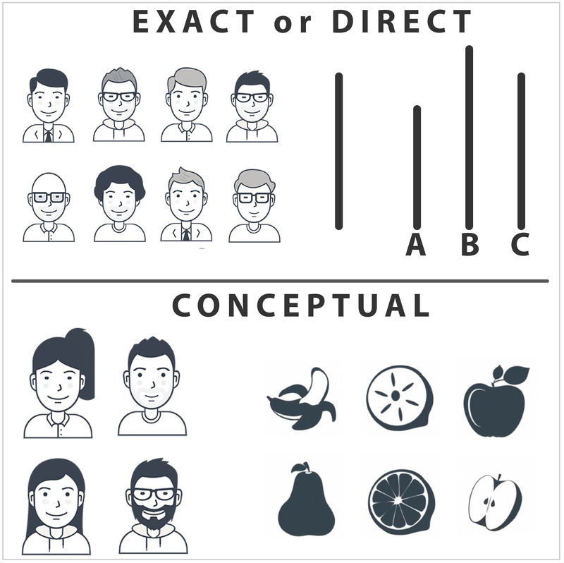

<style type="text/css">
.remark-slide-content {
    font-size: 26px;
    padding: 1em 4em 1em 4em;
}
</style>

## REPLICATION

Replication crisis

- Successful replication rate: 39% ([OSF, 2015](https://science.sciencemag.org/content/349/6251/aac4716)).

</br>

How can we assess whether findings are real?
- By means of replications!

</br>

Replication of results is paramount!

- If anything, these results show that we need multiple studies to draw a firm conclusion.

???

Hi all, 

Welcome to my presentation on Bayesian Evidence Synthesis.

As the title slide already reveals, Bayesian Evidence Synthesis is a Bayesian 
method that allows to quantify the amount of support in favor of a certain hypothesis 
over studies with different designs.

Before I will talk about what I have done so far, and what I will do in my thesis,
we need to ask ourselves the question why we actually need this method.

As is by now well-known, the social sciences have faced, or even still face, a 
crisis in the reproducibility of research. A large-scale replication study 
revealed that only 39% of the findings in top of the bill psychology journals 
could be replicated. 

This is poses a problem to the social sciences, because replication is essential.
If we are not able to replicate research findings, how do we know whether the
inferred conclusions have any value. Replication studies can increase our knowledge 
about the world, by increasing our confidence in true findings and debunking 
incorrect conclusions.

---

## DIRECT VERSUS CONCEPTUAL REPLICATIONS

.pull-left[
Direct replications assess the statistical reliability of research findings. 

</br>

Conceptual replications assess the validity of research findings.
]

.pull-right[

]

Conceptual replications are needed to assess whether the conclusions of a study 
hold under different circumstances. 

???

Within the replication framework, the focus has been placed traditionally on direct
or exact replications. These direct, or exact replications, redo the original study
on new data, but adhere to the original study design as closely as possible. This 
means that direct replications use the same methods, assess the same conditions,
and thus can be considered identical in terms of study design. Hence, they merely
concern the statistical reliability of the study.

The problem here is that if the design is flawed, and the results depend on a
methodological error, all findings from subsequent studies will similarly depend
on this error. Hence, if the design is flawed, the robustness of results can give
a false believe of certainty in the conclusions. 

Conceptual replications play an important role in overcoming such limitations,
because they allow to test whether the initial conclusions hold under a different
design. For example, psychological and psychiatric researchers may be interested
in the effect of stress on depressive symptoms. So, they would expect
that depressive symptoms increase as individuals experience more stress. Accordingly, 
the result should be independent of how the presence of depressive symptoms is assessed. 
Regardless of whether depressive symptoms are assessed by one questionnaire or another, 
or by a clinician. Given that all these measures are sufficiently accurate in determining
the amount of depressive symptoms, the relationship should be observable. 

Hence, conceptual replications are an important way to assess whether conclusions
of different studies hold. 

---

## Analyzing conceptual replications

Results from conceptual replications are hard to aggregate.


- Different operationalizations of key variables

- Different statistical models

This renders conventional approaches (e.g., meta-analysis) unfeasible. 


```{r, echo = FALSE, dpi = 400, fig.height=9, message = FALSE}
library(ggplot2)
library(patchwork)
library(tidyverse)

x <- rnorm(100)
y <- x + rnorm(100)
g <- cut(x, 
         qnorm(c(0, 1/3, 2/3, 1)), 
         labels = c("Low", "Medium", "High"))

d1 <- data.frame(Outcome = y, Stress = x)
d2 <- data.frame(Outcome = y, Stress = g)
p1 <- ggplot(d1, aes(x = Stress, y = Outcome)) +
  geom_point() +
  theme_minimal()

p2 <- ggplot(d2, aes(x = Stress, y = Outcome)) +
  geom_boxplot(fill = "dark green") +
  theme_minimal() +
  theme(axis.text.x = element_text(angle = 45, hjust = 1))
```

???

However, analyzing conceptual replications and aggregating the results is not a 
straightforward task. As the study design get more heterogeneous, averaging
estimates over the studies may become meaningless. For example, consider that 
two research groups assess to what extent psychological stress, in this figure on 
the x-axis, is related to depressive symptoms, here on the y-axis. 
One research group might have access to a continuous scale score of perceived 
stress (shown in the upper plot), while another research group has just three categorical
indicators of perceived stress (the bottom figure). Even if both research groups 
find a similar conclusion, it is hard to aggregate the results statistically, 
even though the studies are conceptually similar. Because the effects differ 
statistically, conventional approaches as meta-analysis are not feasible. Hence, 
we need a different solution.

---

## Bayesian Evidence Synthesis

Solution: Bayesian Evidence Synthesis (BES; [Kuiper, Buskens, Raub, Hoijtink, 2012](https://doi.org/10.1177/0049124112464867)).

Technically:

1. Specify initial prior model probabilities for the set of hypotheses under consideration;
2. Calculate Bayes factors for the hypotheses under consideration in study 1;
3. Calculate the posterior model probabilities for the hypotheses in study 1 by combining the initial prior model probabilities with the Bayes factors;
4. Use these posterior model probabilities as prior model probabilities in study 2;
5. Combine these with Bayes factors in study 2, yielding new posterior model probabilities;
6. Continue until all studies are included.
    
???

Such a different solution is available in the form of Bayesian Evidence Synthesis.
Just as meta-analysis, Bayesian Evidence Synthesis is designed to aggregate the
results over multiple studies. However, unlike meta-analysis, BES does not pool
the parameter estimates. Hence, we do not obtain an "average" effect or something
like that. Rather, Bayesian Evidence Synthesis, expresses the support for the 
scientific theory / overall hypothesis of interest. Doing so, it makes use of the
Bayes factor, which is a common method to evaluate the relative support for
hypotheses within a single study. 

The technical explanation is on the slides (just for background information if you
want to know more about it), but I will give an intuitive explanation.

In a nutshell, the approach works as follows.

First, one determines the relative support for the hypotheses under consideration
in the first study. Using the Bayes factor, one can express the support for the
hypotheses under consideration. Accordingly, one can update the support over the
studies. In fact, this means that the support for the hypotheses that stems from
study can are used to update the support for the hypotheses after study 2. Then,
we obtain the support for the hypothesis of interest over study 1 and study 2 
combined. Subsequently, this value can be used to update the support for the
hypotheses in study 3. This process is repeated until all studies are included
in the final measure of support. Note that for this final measure, the order
of analysis does not matter. 

In the end, BES quantifies the plausibility of the hypotheses under consideration
over all studies combined. Hence, it should be interpreted as "what is the support
each hypothesis receives over all studies".


---

## Example: stress and depressive symptoms

```{r, echo = FALSE, message = FALSE, dpi = 400, fig.height=4}
yb <- cut(y, 
          breaks = qnorm(c(0, 0.5, 1)),
          labels = c("No symptoms", "Symptoms"))

d3 <- data.frame(Outcome = yb, Stress = x)
d4 <- data.frame(Outcome = yb, Stress = g)

p3 <- ggplot(d3, aes(x = Stress, y = Outcome)) +
  geom_boxplot(fill = "dark green") +
  theme_classic()

p4 <- ggplot(d4, aes(x = Stress, y = Outcome)) +
  geom_count()


p4 <- d4 %>%
  group_by(Stress, Outcome) %>%
  summarize(Freq = n()) %>%
  ggpubr::ggballoonplot(x = "Stress", y = "Outcome", 
                        size = "Freq", fill = "dark green")

p1 + xlab("") + p2 + ylab("") + xlab("") + p3 + p4
```

???

Let me illustrate the flexibility of Bayesian Evidence Synthesis with a small example.
Returning to the previous case, in which different research groups were interested
in the relationship between stress and depressive symptoms. Now consider that there
exists a continuous measure of depressive symptoms, a scale-score, and a dichotomous
measure, that indicates whether or not people have symptoms. Likewise, there are two
measures of stress, a continuous variable containing once a again a scale-score of 
stress, and a categorical variable indicating whether someone perceives low, medium
or high stress in daily life. Now consider the situation that there are four research
groups, that all assessed the relationship between stress and depressive symptoms,
and all had a single combination of these two variables. Clearly, there is a positive
relationship in all studies. 

However, using conventional methods, these results can never be aggregated, because
the variables have different scales, and the models that must be used to analyse 
these data are also very different. 

Bayesian evidence synthesis does allow to summarize the evidence in favor of the
relationship between stress and depressive symptoms explicitly. As such, 
Bayesian Evidence Synthesis allows to do things that were not possible before, which
could lead to a robust synthesis of research findings in a wide range of fields. 

However, as this method has been developed only recently, its empirical performance
has hardly been assessed. Although the method is theoretically (that is, mathematically)
sound, it is relatively hard to predict how well the method will perform when we
aim for a synthesis of results. Hence, research into the methods empirical performance
in realistic settings is necessary. 

---

## What needs to be investigated?

Power issues

- Sample size
- Effect size

Complexity of hypotheses.

- Bayes factors are a trade off between fit and complexity.

???

This brings us to what must be done, and also to what I will do in my thesis. Bayes 
factors are well-known to be highly dependent on the power of the study under 
consideration. To what extent this hinders the performance
of Bayesian Evidence Synthesis is not known yet. 

Likewise, Bayes factors assess the trade off between the fit and the complexity, which
is a measure of the freedom the hypothesis gives to the parameters. If you expect very
specific values for the parameters, they can take on only a small range of values, and
the complexity is small. 

Returning to the previous example, if we have a continues measure of stress and a
categorical measure with three levels. If we hypothesize a positive relationship, 
we can hypothesize that the regression coefficient for the effect of stress is 
positive. However, when we assess the same hypothesis with a categorical variable,
we might expect that the low stress category scores lowest on depressive symptoms,
then the medium stress category, and that the high stress category scores highest
on depressive symptoms. This latter formulation would place more constraints on 
the parameters that will be estimated, and thus affects the Bayes factor. However,
how severe this effect will be in the case of Bayesian Evidence Synthesis is not 
known. It is important though, because if the complexity of the hypotheses becomes
the main driver of the outcome of the method, the fit of the data to the hypothesis
becomes negligible. However, we obviously want our hypotheses to provide a good fit
to the data. 

---

## Simulation study

Generate data to represent multiple studies, and vary

- data generating mechanisms (linear, logistic and probit regression);
- sample sizes and effect sizes.

Assess the effect of the complexity of the hypotheses on the performance of *BES*.

- Separate a continuous variable into multiple categories.
- Compare a factor score with separate variables. 

Evaluate *BES* in terms of the true hypothesis rate (THR). 

- Assess general patterns (increase with sample and effect size).
- $THR > 0.8$ is good. 

???

We will assess these issues in a simulation study. As a benchmark, we will 
conduct a simple simulation with varying sample sizes and effect sizes, and a
varying number of studies. In these simulations, we will also vary the data
generating mechanism, and thus require that the data that represents different
studies is analyzed using different models. This allows to assess which conditions 
are minimally required to obtain a good performance. In general, we expect to see 
that BES gives most support to the hypotheses conform which the data is generated
as the sample size and effect size increase. 


Additionally, we will assess the effect of the complexity of the hypotheses on the 
true hypothesis rate. For example, we can simulate the performance of the method 
in case we have a single continuous variable, and likewise assess the performance 
of the method when this continuous variable is transformed to a categorical variable
with multiple categories. 
Similarly, we can assess what happens to the performance of BES when we have a
construct that is measured by multiple variables, and compare this with a situation
in which we represent the effect of this construct as a single factor score. 

In general, we will assess the performance of BES in terms of general patterns. So,
does the true hypothesis indeed receive more support when the sample size and effect
size increase. Gets the true hypothesis more or less support when this hypothesis
has a lower complexity. 
Additionally, we will look at the absolute value of the true hypothesis rate. If
our method selects the true hypothesis 80% of the time, we consider it good 
performance.

---

## Highlights

Conceptual replications are fundamental in science.

BES quantifies the support for hypotheses over conceptual replications. 

Our simulations will showcase under which conditions BES can be applied.

Researchers must be equipped with methods that allow to build a robust body of evidence.

???

To sum it up, I have shown why conceptual replications are a fundamental aspect of
science. Building upon this, I have illustrated why we need a measure to statistically
aggregate the support for a theory over multiple conceptual replications, and that
this method is available in Bayesian Evidence Synthesis. Bayesian Evidence Synthesis
quantifies the support for the hypotheses of interest over multiple conceptually 
similar studies, regardless of methodological differences between studies. 
In our simulations, we will give practical guidance to researchers who aim to
combine support for their theories over multiple studies. Hence, we will equip
applied researchers with practical tools that will help them to build a robust
body of evidence.


